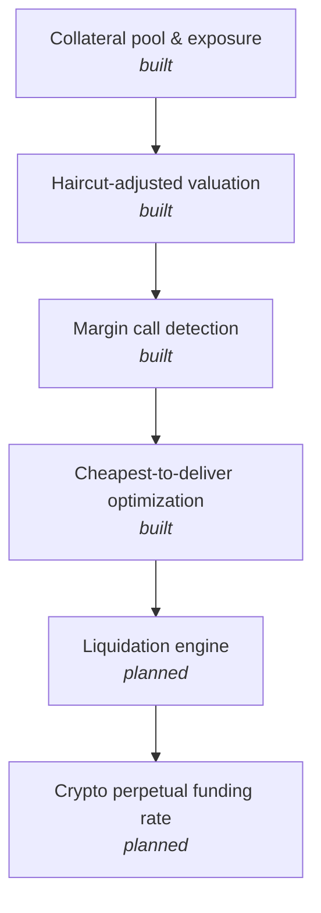

# Collateral & Margin Engine

Haircut-adjusted collateral valuation, margin call detection, and cheapest-to-deliver collateral optimization, the mechanics underneath both crypto perpetual futures margining and traditional repo or derivatives collateral management.

## Why this exists

Exposure gets compared against haircut-adjusted collateral value in both crypto margining and traditional treasury collateral management; the only real difference is the reference price and the haircut conventions. This project demonstrates that shared mechanics directly, and specifically the optimization problem treasury teams actually solve day to day: given several eligible collateral types, which ones do you actually post to minimize the use of cash or other flexible collateral.

## Architecture



## Design decisions

Collateral value is always reported two ways: market value and haircut-adjusted value. The haircut exists specifically to absorb the risk that the collateral itself loses value before it can be liquidated, so margin calls are always measured against the haircut-adjusted figure, never the raw market value, the same way a real collateral management system works.

The cheapest-to-deliver optimizer defaults to pledging the highest-haircut (lowest quality) eligible collateral first. That's deliberate: it mirrors the actual treasury incentive, which is to preserve cash and high-quality liquid assets for other uses (funding, other margin calls, regulatory liquidity buffers) rather than tying them up unnecessarily when lower-grade eligible collateral would satisfy the same requirement. The `demo.py` scenario shows this directly: given a choice between cash, government bonds, corporate bonds, and equities, the optimizer reaches for equity and corporate bonds first and leaves the cash untouched, even though cash would have been the simplest thing to post.

## Getting started

Requires Python 3 only — no external dependencies.

```bash
git clone <your-repo-url>
cd collateral-margin-engine
python3 demo.py
```

Expected output:

```
Margin call check on currently pledged collateral:
  Required margin: $1,000,000.00
  Pledged (haircut-adjusted) value: $790,000.00
  Shortfall: $210,000.00
  Margin call triggered: True

Cheapest-to-deliver optimization to cover the full requirement:
  Pledge C4 (equity): market value $300,000.00, haircut 15%, counts as $255,000.00
  Pledge C3 (corp_bond): market value $400,000.00, haircut 8%, counts as $368,000.00
  Pledge C2 (govt_bond): market value $500,000.00, haircut 2%, counts as $490,000.00
  Total pledged (haircut-adjusted): $1,113,000.00
  Requirement met: True
  Cash preserved (not pledged): ['C1']
```

## Project structure

```
collateral_engine.py    # haircut valuation, margin call detection, cheapest-to-deliver optimization
demo.py                   # end-to-end example
README.md
```

## Roadmap

- Liquidation engine: trigger logic for when a margin call goes uncured within a deadline
- Crypto perpetual futures funding rate mechanics, extending the same haircut/margin framework to a mark-price-vs-index-price context
