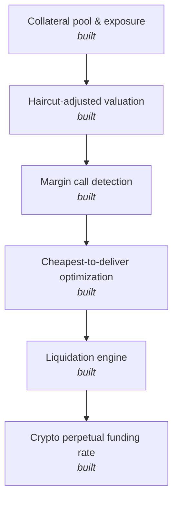

# Collateral & Margin Engine

Haircut-adjusted collateral valuation, margin call detection, and cheapest-to-deliver collateral optimization, the mechanics underneath both crypto perpetual futures margining and traditional repo or derivatives collateral management.

## Why this exists

Exposure gets compared against haircut-adjusted collateral value in both crypto margining and traditional treasury collateral management; the only real difference is the reference price and the haircut conventions. This project demonstrates that shared mechanics directly, and specifically the optimization problem treasury teams actually solve day to day: given several eligible collateral types, which ones do you actually post to minimize the use of cash or other flexible collateral.

## Architecture



## Design decisions

Collateral value is always reported two ways: market value and haircut-adjusted value. The haircut exists specifically to absorb the risk that the collateral itself loses value before it can be liquidated, so margin calls are always measured against the haircut-adjusted figure, never the raw market value, the same way a real collateral management system works.

The cheapest-to-deliver optimizer defaults to pledging the highest-haircut (lowest quality) eligible collateral first. That's deliberate: it mirrors the actual treasury incentive, which is to preserve cash and high-quality liquid assets for other uses (funding, other margin calls, regulatory liquidity buffers) rather than tying them up unnecessarily when lower-grade eligible collateral would satisfy the same requirement. The `demo.py` scenario shows this directly: given a choice between cash, government bonds, corporate bonds, and equities, the optimizer reaches for equity and corporate bonds first and leaves the cash untouched, even though cash would have been the simplest thing to post.

The liquidation engine deliberately inverts that priority. When a margin call goes uncured past its deadline, the collateral actually being sold gets liquidated most-liquid-first rather than least-liquid-first, since the goal under forced liquidation is minimizing execution risk and market impact, not preserving optionality. A liquidation discount is also applied on top of the normal haircut at this stage, reflecting the real fire-sale pricing impact of a forced sale, something the voluntary cheapest-to-deliver flow never has to account for. `liquidation_demo.py` walks through both a cured and an uncured scenario side by side, then shows the liquidation actually executing across multiple asset types until the shortfall is covered.

The funding rate module is the crypto-specific piece, but it plugs into the same margin logic rather than sitting off to the side: a perpetual future has no expiry, so its price gets anchored to an underlying index through periodic funding payments instead, and `funding_demo.py` shows that those payments are not a side detail, they directly erode account equity the same way any other loss does. The demo runs nine consecutive funding intervals on a position with a persistent premium, watches equity decay payment by payment, and then runs the exact same `margin_call()` function from `collateral_engine.py` against the eroded balance, showing that sustained funding cost alone is enough to trigger a real margin call, the same mechanism a forced liquidation downstream of that call would use.

## Getting started

Requires Python 3 only — no external dependencies.

```bash
git clone <your-repo-url>
cd collateral-margin-engine
python3 demo.py
python3 liquidation_demo.py
python3 funding_demo.py
```

Expected output from `demo.py`:

```
Margin call check on currently pledged collateral:
  Required margin: $1,000,000.00
  Pledged (haircut-adjusted) value: $790,000.00
  Shortfall: $210,000.00
  Margin call triggered: True

Cheapest-to-deliver optimization to cover the full requirement:
  Pledge C4 (equity): market value $300,000.00, haircut 15%, counts as $255,000.00
  Pledge C3 (corp_bond): market value $400,000.00, haircut 8%, counts as $368,000.00
  Pledge C2 (govt_bond): market value $500,000.00, haircut 2%, counts as $490,000.00
  Total pledged (haircut-adjusted): $1,113,000.00
  Requirement met: True
  Cash preserved (not pledged): ['C1']
```

Expected output from `liquidation_demo.py`:

```
Margin call shortfall: $900,000.00

Scenario A -- additional collateral posted in time:
  Remaining shortfall: $0.00
  Cured: True
  Liquidation required: False

Scenario B -- deadline missed, nothing posted in time:
  Remaining shortfall: $900,000.00
  Cured: False
  Liquidation required: True

Triggering liquidation, most liquid assets first:
  Liquidate C1 (cash): haircut value $300,000.00, liquidation discount 0%, net proceeds $300,000.00
  Liquidate C2 (govt_bond): haircut value $490,000.00, liquidation discount 1%, net proceeds $485,100.00
  Liquidate C3 (corp_bond): haircut value $368,000.00, liquidation discount 4%, net proceeds $353,280.00
  Total proceeds: $1,138,380.00
  Residual shortfall: $0.00
  Fully covered: True
```

Expected output from `funding_demo.py`:

```
Mark price: $65,200.00   Index price: $65,000.00
Premium rate: 0.3077%
Funding rate (this interval): 0.2577%

Long position notional: $500,000.00
Funding payment this interval: $-1,288.46 (pays)

Cumulative funding over 9 intervals (3 days at 8h funding) with a persistent premium:
  Interval 1: equity = $48,711.54
  Interval 2: equity = $47,423.08
  Interval 3: equity = $46,134.62
  Interval 4: equity = $44,846.15
  Interval 5: equity = $43,557.69
  Interval 6: equity = $42,269.23
  Interval 7: equity = $40,980.77
  Interval 8: equity = $39,692.31
  Interval 9: equity = $38,403.85

Checking whether accumulated funding alone has triggered a margin call:
  Maintenance margin required: $40,000.00
  Current equity (haircut-adjusted): $38,403.85
  Shortfall: $1,596.15
  Margin call triggered: True
```

## Project structure

```
collateral_engine.py     # haircut valuation, margin call detection, cheapest-to-deliver optimization
liquidation_engine.py      # cure-deadline checking and forced liquidation, most-liquid-first
funding_engine.py            # perpetual futures premium and funding rate, funding cash flows
demo.py                        # end-to-end margin call and optimization example
liquidation_demo.py               # end-to-end cure-deadline and liquidation example
funding_demo.py                      # end-to-end funding accrual example tied into the margin call check
README.md
```

## Status

All planned pieces are built: haircut valuation, margin call detection, cheapest-to-deliver optimization, forced liquidation, and crypto perpetual funding rate mechanics. The funding module deliberately reuses `margin_call()` rather than duplicating the logic, since funding payments and collateral shortfalls are really the same risk surfacing from two different sources.
